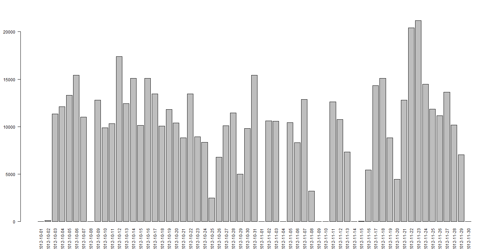
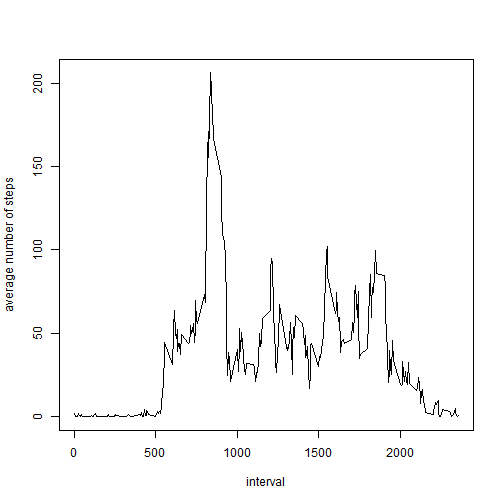
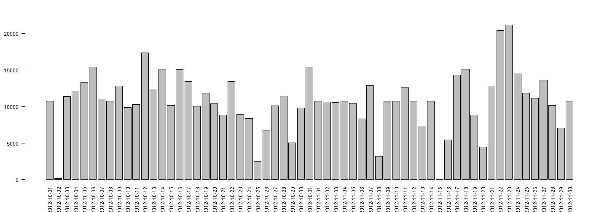
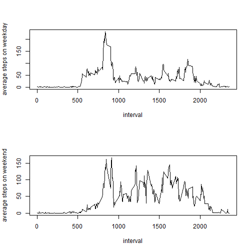

# Reproducible Research: Peer Assessment 1


## Loading and preprocessing the data

```r
unzip("activity.zip")
data <- read.csv("activity.csv")
```
## What is mean total number of steps taken per day?


```r
stepsByDay <-aggregate(data$steps,by=list(data$date),FUN=sum,na.rm=TRUE)
par(las=2)
barplot(stepsByDay$x,names.arg=stepsByDay$Group.1,axisnames=TRUE)
```

 


```r
mean(stepsByDay$x)
```

```
## [1] 9354
```

```r
median(stepsByDay$x)
```

```
## [1] 10395
```
## What is the average daily activity pattern?

```r
averageDaily <- aggregate(data$steps,by=list(data$interval),FUN=mean,na.rm=TRUE)
plot(averageDaily$Group.1,averageDaily$x,type='l',xlab="interval",ylab="average number of steps")
```

 

```r
averageDaily[which.max(averageDaily$x),1]
```

```
## [1] 835
```
## Imputing missing values

```r
sum(is.na(data))
```

```
## [1] 2304
```

```r
for(i in 1:nrow(data))
{
	if (is.na(data$steps[i]))
	{
		data$steps[i] <- averageDaily[which(averageDaily$Group.1==data$interval[i]),]$x
	}
}
par(las=2)
stepsByDay <-aggregate(data$steps,by=list(data$date),FUN=sum,na.rm=TRUE)
barplot(stepsByDay$x,names.arg=stepsByDay$Group.1,axisnames=TRUE)
```

 


```r
mean(stepsByDay$x)
```

```
## [1] 10766
```

```r
median(stepsByDay$x)
```

```
## [1] 10766
```
## Are there differences in activity patterns between weekdays and weekends?

```r
library(plyr)
# Sys.setlocale("LC_TIME","English United States")
# weekdays(Sys.Date()+0:6)
# data$conversion <- factor(mapvalues(weekdays(as.Date(data$date)),
#                        c("Monday", "Tuesday", "Wednesday", "Thursday", "Friday","Saturday", "Sunday"),
#                        c(rep("weekday", 5), rep("weekend", 2))))
	
data$conversion <- factor(mapvalues(weekdays(as.Date(data$date)),
                        c("lundi", "mardi", "mercredi", "jeudi", "vendredi","samedi", "dimanche"),
                        c(rep("weekday", 5), rep("weekend", 2))))	
```


```r
par(mfrow=c(2,1))
weekday=subset(data,data$conversion=="weekday",na.rm=TRUE)
weekend=subset(data,data$conversion=="weekend",na.rm=TRUE)
weekdaystep = tapply(X = weekday$steps, INDEX = weekday$interval,FUN = mean)
plot(x=weekday$interval[1:288],y=weekdaystep,type="l",xlab="interval",
ylab="average steps on weekday")
weekendstep = tapply(X = weekend$steps, INDEX = weekend$interval,FUN = mean)
plot(x=weekday$interval[1:288],y=weekendstep,type="l",xlab="interval",
ylab="average steps on weekend")
```

 
